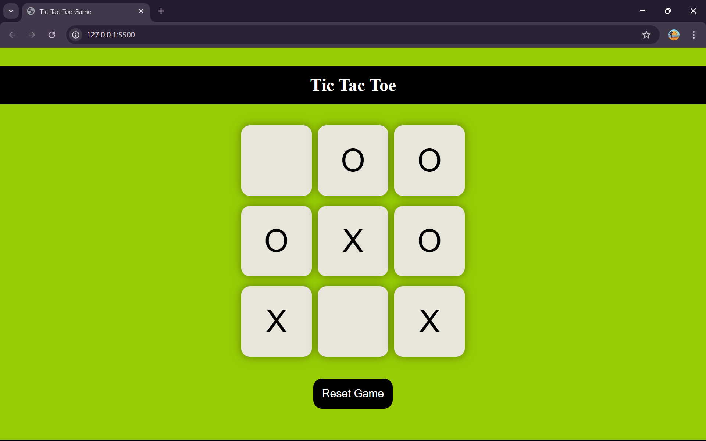

# 🎮 Tic Tac Toe Game  

A simple and fun **Tic Tac Toe project** built with **HTML, CSS, and JavaScript**.  
Play against a friend in this classic 3x3 board game right in your browser!  

🌐 **Live Demo**: [Play Here](https://BharathPadavu.github.io/tic-tac-toe-game)  

---

## 📸 Screenshot (Preview)


---

## 🚀 Features  

🎲 **Classic 3×3 Grid Gameplay** – players take turns placing X and O.  

👥 **Two-Player Mode** – play with a friend on the same device.  

🏆 **Winner Detection** – game checks winning combinations and displays the winner.  

🔄 **Reset & New Game Options** – restart the board without refreshing the page.  

🖥️ **Basic Responsive Design** – the board and elements resize to fit different screen sizes using CSS flexbox and `vmin` units.  

⚡ **Built with Pure HTML, CSS & JavaScript** – no external libraries or frameworks.  

🎨 **Clean and Minimal UI** – simple styling with CSS3 (shadows, flexbox, responsive units).

---

## 🛠️ Tech Stack
- HTML5  
- CSS3  
- JavaScript

---

## ⚠️ Limitations  

- **No AI Opponent** – only supports 2 players on the same device (no single-player mode).  
- **No Draw Detection** – the game does not automatically announce a draw if all cells are filled with no winner.  
- **Basic Responsiveness** – layout scales with screen size, but not fully optimized for very small screens or mobile-first design.  
- **No Score Tracking** – scores reset after each new game (no history of wins/losses).


## 📥 How to Run Locally
```bash
git clone https://github.com/BharathPadavu/tic-tac-toe-game.git
cd tic-tac-toe-game
open index.html
